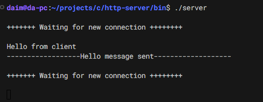
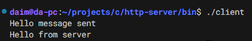

# minimal http-server

## Server-Side Running

## Client-Side Running

### Guide Article
[HTTP Server: Everything you need to know to Build a simple HTTP server from scratch](https://medium.com/from-the-scratch/http-server-what-do-you-need-to-know-to-build-a-simple-http-server-from-scratch-d1ef8945e4fa)
